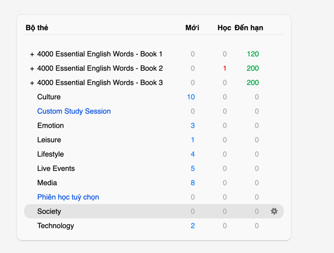
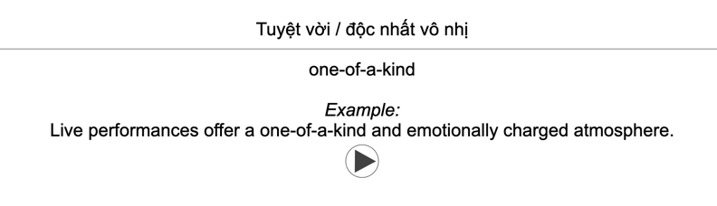
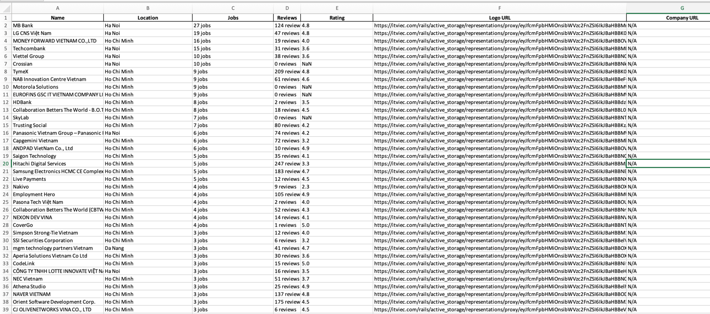

# Personal Tools

Đây là bộ công cụ cá nhân được thiết kế để giúp tối ưu hóa công việc và học tập của tôi. Các công cụ hiện tại bao gồm:

## Các công cụ hiện tại

### 1. **Tạo thẻ từ vựng cho ứng dụng Anki tự động**
   - **Mô tả**: Công cụ này giúp tự động tạo thẻ từ vựng để sử dụng trong ứng dụng Anki. Từ vựng được thu thập từ các nguồn tài liệu học tập và được chuyển thành thẻ Anki với định dạng thích hợp để dễ dàng học thuộc.
   - **Chức năng chính**:
     - Thu thập từ vựng từ tài liệu học tập.
     - Tạo thẻ từ vựng với các tính năng như nghĩa, ví dụ, phát âm, v.v.
     - Tự động xuất thẻ từ vựng sang Anki với định dạng hỗ trợ.
   - **Hình ảnh**:
     
     

### 2. **Lấy thông tin công ty và việc làm trên ITViet**
   - **Mô tả**: Công cụ này truy xuất thông tin về các công ty và cơ hội việc làm từ trang web ITViet. Các thông tin bao gồm mô tả công ty, yêu cầu công việc, mức lương, và nhiều thông tin hữu ích khác.
   - **Chức năng chính**:
     - Truy xuất thông tin về các công ty công nghệ tại Việt Nam.
     - Lấy thông tin chi tiết về các cơ hội việc làm và xuất ra file Excel.
     - Tìm kiếm và lọc các công việc phù hợp theo các tiêu chí khác nhau nhờ vào file Excel.
   - **Hình ảnh**:
     

## Các tính năng sắp tới
   - Tôi sẽ cập nhật thường xuyên các công cụ mới. Nếu bạn thấy hữu ích, có thể follow để nhận những cập nhật mới nhất.

---

Hy vọng bản README này đã đáp ứng nhu cầu của bạn!